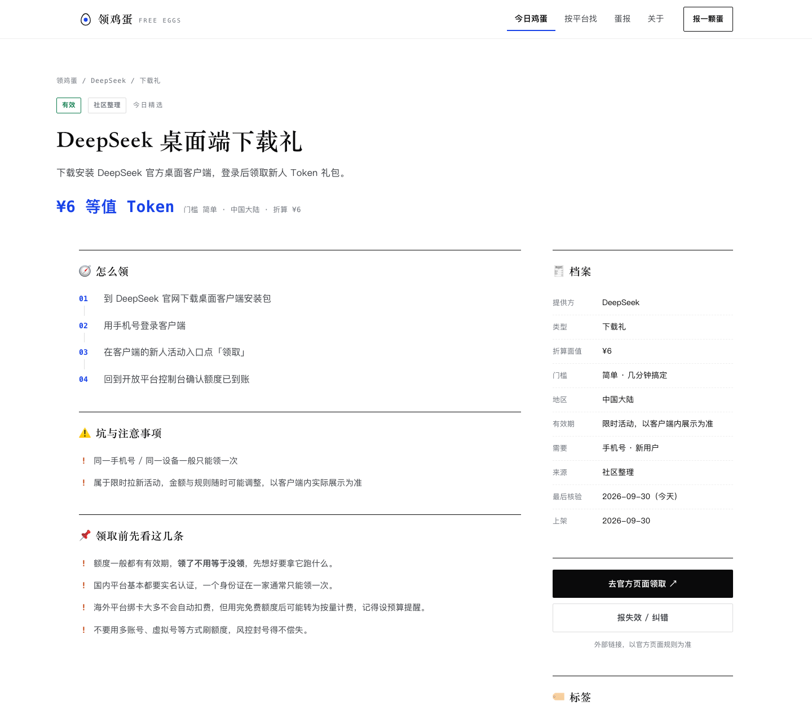

# 领鸡蛋 · freeeggs

> 一代人有一代人的鸡蛋要领。

上一代人的鸡蛋在超市门口排队领，这一代人的鸡蛋在对话框里。

**领鸡蛋**是一个每日更新的 AI 免费额度情报站：把国内大模型平台和海外 API 的新手 Token、免费层、学生礼包、云试用金收在一处，并且给每一条都标上**门槛、截止时间、最后核验日期和来源可信度**。

## 它长什么样




投稿页会把你的输入实时整理成结构化 Markdown，一键提交：


## 为什么值得做

各家平台为了拉新常年送额度，但这些福利散落在几十个控制台里，规则天天变，过期了也不通知你。现有的一些汇总清单的问题是：**分不清哪条还有人维护**。

所以本站的核心不是「列得多」，而是**敢说哪条没核实过**。每条目录都带三个字段：

| 字段 | 作用 |
| --- | --- |
| `confidence` | 来源可信度：官方公示 / 社区整理 / 待核验 |
| `verifiedAt` | 最后一次人工核验的日期，`null` 就是没核验过 |
| `status` | 有效 / 快结束 / 待核验 / 已失效 |

页面上会直白地显示「尚未核验」。宁可显示「不知道」，也不假装核实过。

## 快速开始

需要 **Node ≥ 22.12**（脚本用原生 TS 导入，不需要编译）。

```bash
pnpm install
pnpm dev          # 本地预览 http://localhost:4321
pnpm build        # 数据体检 + 构建到 dist/
pnpm preview      # 预览构建产物
```

> 仓库里的 `.npmrc` 把 pnpm store 指到了项目内（`.pnpm-store/`），这是为了在受限环境里也能装依赖。
> 如果你本机 pnpm 正常，删掉 `.npmrc` 即可。

### 日常维护命令

```bash
pnpm run check                    # 数据体检：id 重复、字段非法、逻辑矛盾，构建前自动跑
pnpm run stale                    # 今天该复核哪几条（人看的清单）
pnpm run stale -- --markdown      # 生成 Markdown，CI 用它更新 issue
pnpm run stale -- --exit-code     # 有待复核就以退出码 1 结束
MAX_AGE_DAYS=7 pnpm run stale
```

## 每天自动提醒复核

`.github/workflows/reverify.yml` 每天北京时间 09:00 跑一次：

1. `pnpm run check` —— 数据不合法直接失败
2. `node scripts/stale.mjs --markdown` —— 算出「从未核验 / 太久没动 / 已过期但没撤架 / 快到期」四类
3. 把这四类更新到**同一个** issue（标题 `🔍 复核清单（自动更新）`）里，条目是可直接勾掉的 checkbox

用同一个 issue 滚动更新，而不是每天新建，免得刷屏。手动触发用 `workflow_dispatch`。

## 投稿

`/submit` 是个纯前端表单：填完实时生成结构化 Markdown，然后

- **用 GitHub 提交** —— 打开一个已经填好标题和正文的 issue 页面，确认后提交
- **复制内容** —— 粘到邮件或聊天里发过来
- **邮件投稿** —— 在 `src/data/site.ts` 里填了 `email` 才会出现

另外 `.github/ISSUE_TEMPLATE/report.yml` 提供了一份结构化 issue 表单，走 GitHub 原生入口也能填得整齐。

> 想让访客**不需要 GitHub 账号**也能提交，需要一个后端。表单已经预留了位置，
> 接一个 Cloudflare Pages Function 或 Vercel Function 调 GitHub API 建 issue 即可，前端不用改。

## 目录结构

```
src/
├─ data/
│  ├─ eggs.ts        ← 鸡蛋目录，日常主要改这里
│  ├─ providers.ts   ← 平台清单
│  ├─ digests.ts     ← 蛋报（每日简报）
│  ├─ site.ts        ← 站名、副标题、联系方式、词表
│  └─ types.ts       ← 数据模型
├─ layouts/BaseLayout.astro
├─ components/
│  ├─ EggRow.astro      ← 榜单列表行（目录 / 平台页 / 相关推荐共用）
│  └─ EggFeature.astro  ← 精选小格
├─ lib/format.ts
├─ pages/
│  ├─ index.astro            ← 首页：报头 + 今日精选 + 领蛋三步 + 蛋报
│  ├─ eggs/index.astro       ← 全部鸡蛋：完整目录 + 筛选搜索
│  ├─ eggs/[id].astro        ← 单条详情：领取步骤、坑、档案
│  ├─ providers/…            ← 按平台浏览
│  ├─ daily.astro            ← 蛋报
│  ├─ submit.astro           ← 下个蛋：投稿表单
│  ├─ about.astro            ← 核验规范与免责声明
│  ├─ eggs.json.ts           ← 开放数据接口
│  ├─ rss.xml.ts / sitemap.xml.ts
│  └─ 404.astro
└─ styles/egg.css            ← 设计系统（报刊编辑风）
scripts/
├─ check.mjs   ← 数据体检
└─ stale.mjs   ← 复核清单（支持 --markdown / --exit-code）
```

## 设计

报刊编辑风排版 + 冷调极简配色，不靠卡片堆叠：

- **白底近黑字**，全站只有一个强调色：电光蓝 `#1943E8`（深色模式下换成 `#7D9BFF`）
- 大字宋体报头，蓝色只点在一个字和关键数字上
- 用**细分隔线**和留白划分区块，而不是圆角卡片加阴影
- 栏目标记统一用等宽字体做小号大写字距（`01 / 今日精选`）
- 目录是榜单式列表行，不是卡片网格 —— 扫读效率更高
- 蛋报区用整块冷调墨黑背景制造对比
- **首页只放头版内容**（精选、三步、蛋报），完整目录和筛选器在 `/eggs`，不把首页撑成一根长条
- **栏宽随屏幕放大**：基础 1720px，2200px 以上到 1960px。字号、行高、卡片内边距同步放大 ——
  光拉宽不改字，只会让内容在 2K/4K 屏上显得稀。正文类内容（`.prose`、摘要）单独限制行长，不会拉成一条长线
- 自适应深色模式，滚动时元素轻微上浮

动效与质感单独放在 [src/styles/fx.css](src/styles/fx.css)（在 egg.css 之后加载），互不污染：

- 报头背后一层**极光微光**，纯 CSS 动画，鼠标移动时还有光晕跟随
- 全站叠一层 4% 的**噪点**质感，避免大片纯白显得塑料
- 统计数字**滚动计数**；区块进入视口时**逐条浮现**；极光随滚动轻微视差
- 顶栏底部**滚动进度条**；按钮悬停有光泽扫过；列表行悬停左侧滑出
- 站内跳转走 **View Transitions**，标题在不同页面之间连贯变形，不再白屏
- 全部动画尊重 `prefers-reduced-motion`；**关掉 JS 也不会内容不显示**（有一套兜底移除逻辑），
  计数动画另加 `setTimeout` 保底，标签页在后台被节流时也能落到正确数值

配色与排版变量全部集中在 `src/styles/egg.css` 顶部的 `:root`（深色模式是紧随其后的覆盖块），
换肤只动那一处。正文与状态色对白底的对比度均 ≥ 4.5:1，`expired` 也不例外。

## 开放数据

- `/eggs.json` —— 全量目录 + 词表，带 CORS
- `/rss.xml` —— 蛋报与新蛋的订阅源
- `/sitemap.xml`

## 部署

线上地址：**https://freeeggs.xiruistar.cn**（阿里云 ECS + nginx）。

```
PR 合并到 main
   └─ GitHub Actions: deploy.yml
        ├─ pnpm install
        ├─ pnpm run build      ← 内含 check，坏数据直接拦下
        └─ rsync dist/  →  root@47.100.32.255:/var/www/freeeggs/
                                └─ nginx: freeeggs.xiruistar.cn
```

**合并 PR 就会自动上线，约 1～2 分钟。**服务器上不需要装 Node —— 构建全部在 GitHub Actions 完成，
只把 `dist/` 同步过去。日常维护内容完全不用碰服务器，也不用本地构建。

完整的一次性配置（DNS、nginx、certbot、部署密钥、Secrets）见 **[deploy/SETUP.md](deploy/SETUP.md)**。

换托管商也行，纯静态产物，改 DNS 即可：

- **Cloudflare Pages / Vercel / Netlify**：构建命令 `pnpm build`，输出目录 `dist`
- **GitHub Pages**：把 `astro.config.mjs` 里的 `site` 改成 Pages 域名

站点根地址只在 [astro.config.mjs](astro.config.mjs) 的 `site` 一处配置，
RSS、sitemap、canonical 都从它派生，换域名改一行就够。

## 我们不做什么

- 不收录需要买课、拉人头才能解锁的伪福利
- 不教怎么用多账号、虚拟号、接码平台刷额度
- 不替任何厂商背书，链接都是官方地址，不插推广、不拿返佣
- 不保证有效 —— 额度规则随时会变，请以官方页面为准

## 许可

内容以 CC BY-NC 4.0 协议共享。转载注明来源即可。
